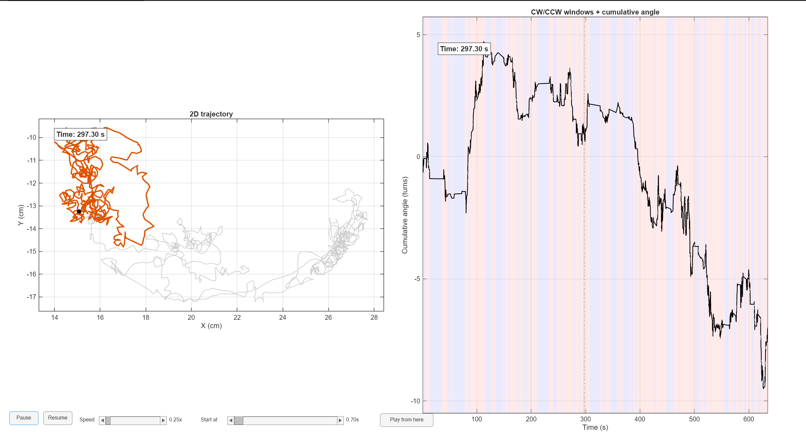

# Daphnia_Handedness_Analysis

MATLAB script for analyzing the **directional turning bias** (clockwise vs counterclockwise) of individual Daphnia from motion tracking data.

This script represents the **third step of the analysis pipeline**, following:

1. Extraction of `.csv` motion data from raw TREX `.npz` files  
2. Calculation of cumulative angular dynamics across all Daphnia  
3. **(This script)**: Classification of CW vs CCW turns and handedness for an individual Daphnia

---

## Research Background

Developed for an undergraduate research project at **CUNY Queens College**, under the supervision of:

- Dr. Oleg Kogan (Physics Department)  
- Dr. Sebastian Alvarado (Biology Department)  

The goal is to investigate **behavioral handedness** in Daphnia by analyzing the balance of clockwise and counterclockwise turns. Such biases may reveal underlying neural or environmental influences on motion.

---

## Features

### Core Analysis
- Loads trajectory data for a **single Daphnia** from CSV file  
- Computes speed distribution and estimates a **velocity threshold (`v*`)**  
- Calculates cumulative angular change over time  
- Divides motion into time windows to detect **CW vs CCW slopes**  
- Counts total CW and CCW turns and computes a **handedness index**  

### Visualization & Interactivity
- Side-by-side plots:
  - **Trajectory view** (2D position of the Daphnia with moving dot)  
  - **Cumulative angle view** (CW/CCW windows highlighted in blue/red)  
- Interactive controls:
  - `Pause` / `Resume` buttons  
  - `Speed slider` (0.25× to 4× playback)  
  - `Scrub/seek slider` to jump to any time point in the dataset  
  - `Play from here` button to resume playback from the chosen time  

---

## Input

CSV file(s) generated from TREX, containing columns:

- `X`, `Y` positions  
- `Time` stamps  
- `fps` values  

---

## Output

**Console:**
- Total CW turns  
- Total CCW turns  
- Handedness index  

**Interactive GUI:**
- Dual-panel animation (trajectory + angle plot)  
- Full control over playback speed and timeline navigation  

---

## Example Output

Below is an example plot generated by the script, showing cumulative angle over time with CW (blue) and CCW (red) windows highlighted:

---

## Use Case

This script helps identify **rotational bias (handedness)** in Daphnia motion, which may indicate:

- Consistent behavioral patterns  
- Responses to environmental cues  
- Potential collective biases in group dynamics  

---

## Dependencies

- MATLAB (tested on R2025a)  
- Statistics & Machine Learning Toolbox (`fit` function)  

---

## Usage

1. Place `.csv` files in your chosen folder  
2. In the script, set:  
   - `base` = dataset name  
   - `inputDir` = folder containing `<base>_csv` files  
   - `d` = Daphnia index to analyze  
   - `timeWindow` = time window length (seconds)  
3. Run the script in MATLAB  
4. Use the interactive controls to explore handedness dynamics in detail  
