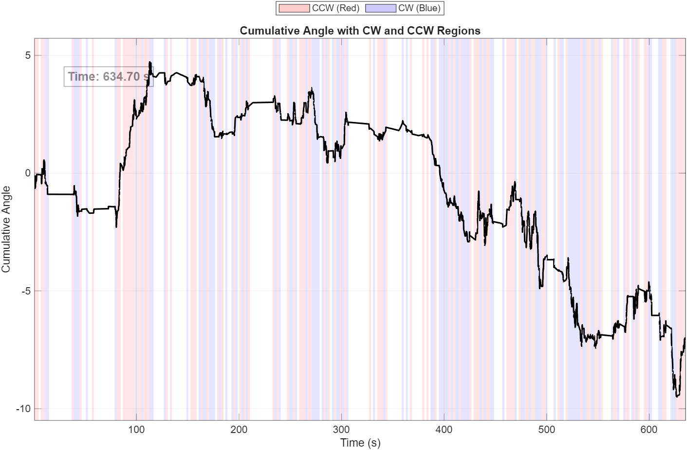

# Daphnia_Handedness_Analysis

This repository contains a MATLAB script for analyzing the **directional turning bias** (clockwise vs counterclockwise) of individual Daphnia from motion tracking data.

This script represents the **third step of the analysis pipeline**, following:
1. Extraction of `.csv` motion data from raw TREX `.npz` files  
2. Calculation of cumulative angular dynamics across all Daphnia  
3. **(This script)**: Classification of CW vs CCW turns and handedness for an individual Daphnia.

---

## Research Background
This code was developed for an undergraduate research project at **CUNY Queens College**, under the supervision of **Dr. Oleg Kogan (Physics Department)** and **Dr. Sebastian Alvarado (Biology Department)**.  

The goal of the project is to investigate **behavioral handedness** in Daphnia by analyzing the balance of clockwise and counterclockwise turns. Such biases may reveal underlying neural or environmental influences on motion.

---

## Features
- Loads trajectory data for a **single Daphnia** from CSV file  
- Computes speed distribution and estimates a **velocity threshold (v\*)**  
- Calculates cumulative angular change over time  
- Divides motion into time windows to detect **CW vs CCW slopes**  
- Counts total CW and CCW turns and computes a **handedness index**  
- Generates plots:
  - Cumulative angle trajectory  
  - Highlighted CW/CCW regions with animated playback  

---

## Input
CSV file(s) generated from TREX, containing:  
- `X`, `Y` positions  
- `Time` stamps  
- `fps` values  

---

## Output
- **Console**:
  - Total CW turns
  - Total CCW turns
  - Handedness index
- **Plots**:
  - Cumulative angle trajectory with CW/CCW highlighted regions
  - Interactive animation (Pause/Resume buttons)

---

## Example Output
Below is an example plot generated by the script, showing cumulative angle over time with CW (blue) and CCW (red) windows highlighted:

---

## Use Case
This script helps identify **rotational bias (handedness)** in Daphnia motion, which may point to:
- Consistent behavioral patterns  
- Responses to environmental cues  
- Potential collective biases in group dynamics  

---

## ⚙Dependencies
- MATLAB (tested on R2022b)  
- Statistics & Machine Learning Toolbox (`fit` function)  

---

## Usage
1. Place `.csv` files in your chosen folder  
2. In the script, set:  
   - `base` = dataset name  
   - `inputDir` = folder containing `<base>_csv` files  
   - `d` = Daphnia index to analyze  
   - `timeWindow` = time window length (seconds)  
3. Run the script in MATLAB  
4. Check console results and plots  

---
